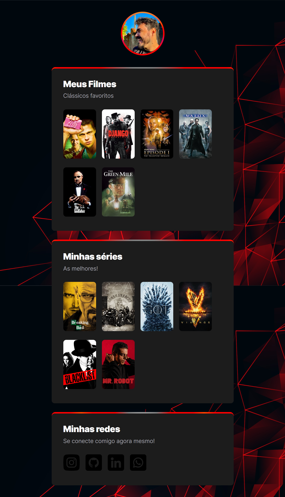

# NLW eSports - Trilha Explorer

> Trilha Explorer

Desafio realizado através do projeto que fiz no evento NLW da rocketseat

[Clique aqui para acessar](https://kennedy-chaves.github.io/Desafio-NLW/)

## Tecnologias

- HTML
- CSS
- Git e Github

## Aprendizado

Esse desafio foi muito bom para fixar o que aprendi durante essa semana. 
Melhorei meus conhecimentos em HTML e css, aprendi a subir projeto no github e o mais importante, tive a certeza de que essa é a área que quero seguir.

## Contato

kennedy-55@hotmail.com
